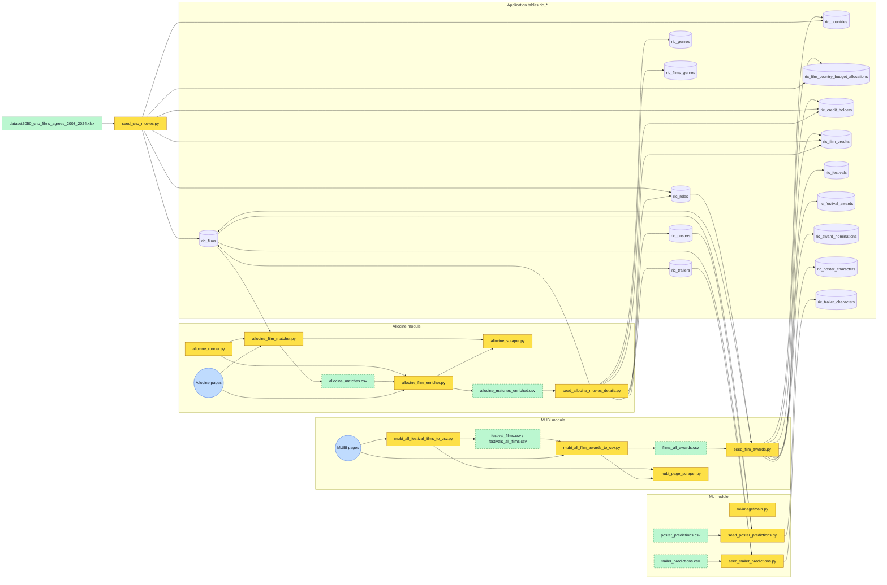

# Architecture ingestion - Airbyte, dbt, Prefect et scraping

## Metadata du document

**Responsable:** Joel Teixeira

**Dernière révision:** 2026-05-08

**Statut:** brouillon

### Historique du document

| #   | Date       | Auteur        | Observations           |
| --- | ---------- | ------------- | ---------------------- |
| 1   | 2026-05-07 | Joel Teixeira | Initial implementation |

## Statut de référence

Ce document est la cible d'architecture de référence pour le module `ingestion`.

1. si un autre document d'architecture diverge de ce schéma cible, c'est ce document qui fait foi;
2. les autres documents d'architecture doivent être lus comme des documents de transition, d'état actuel ou de plan d'exécution.

## Diagramme de flux global actuel

## Architecture cible

```mermaid
flowchart LR

    subgraph GOOGLE_SHEETS[Google Sheets]
        direction TB
        GS_CNC[GSheet AGREEMENT CNC]
        GS_ID_MATCHING[GSheet Film ID matching]
        GS_FILM_CREDITS[GSheet Fix Film credits]
        GS_FILM_GENRES[GSheet Fix Film genres]
        GS_FILMS_COUNTRY_BUDGET_ALLOCATION[GSheet Fix Film country budget allocation]
        GS_AWARD_NOMINATIONS[GSheet Fix award nominations]
        GS_CREDIT_HOLDERS[GSheet Fix credit holders]
        GS_ROLES[GSheet Fix roles]
        GS_GENRES[GSheet Fix genres]
        GS_COUNTRIES[GSheet Fix countries]
        GS_FESTIVAL[GSheet Fix festivals]
        GS_FESTIVAL_AWARDS[GSheet Fix festival awards]
    end

    subgraph AIRBYTE_FLOW[Airbyte flow]
        direction TB
        SRC_GS_CNC[src_gsheet_agreement_cnc]
        SRC_GS_ID_MATCHING[src_gsheet_film_id_matching]

        SRC_GS_FILM_CREDITS[src_gsheet_fix_film_credits]
        SRC_GS_FILM_GENRES[src_gsheet_fix_film_genres]
        SRC_GS_FILMS_COUNTRY_BUDGET_ALLOCATION[src_gsheet_fix_film_country_budget_allocation]
        SRC_GS_AWARD_NOMINATIONS[src_gsheet_fix_award_nominations]
        SRC_GS_CREDIT_HOLDERS[src_gsheet_fix_credit_holders]
        SRC_GS_ROLES[src_gsheet_fix_roles]
        SRC_GS_GENRES[src_gsheet_fix_genres]
        SRC_GS_COUNTRIES[src_gsheet_fix_countries]
        SRC_GS_FESTIVAL[src_gsheet_fix_festivals]
        SRC_GS_FESTIVAL_AWARDS[src_gsheet_fix_festival_awards]

        AB_AGREEMENT[(raw.agreement_cnc)]
        AB_ID_MATCHING[(raw.id_matching)]

        AB_FILM_CREDITS[(raw.fix_film_credits)]
        AB_FILM_GENRES[(raw.fix_film_genres)]
        AB_FILMS_COUNTRY_BUDGET_ALLOCATION[(raw.fix_films_country_budget_allocation)]
        AB_AWARD_NOMINATIONS[(raw.fix_award_nominations)]
        AB_CREDIT_HOLDERS[(raw.fix_credit_holders)]
        AB_ROLES[(raw.fix_roles)]
        AB_GENRES[(raw.fix_genres)]
        AB_COUNTRIES[(raw.fix_countries)]
        AB_FESTIVAL[(raw.fix_festivals)]
        AB_FESTIVAL_AWARDS[(raw.fix_festival_awards)]

    end

    subgraph SCRAPING_FLOW[Scraping flow]
        direction TB
        SCRAPE_ALLOCINE[Allocine scraping job<br/>ingestion/scraping/allocine/main.py]
        SCRAPE_MUBI[MUBI scraper<br/>scraping_mubi.py]
        AB_ALLOCINE[(raw.allocine_data)]
        AB_MUBI[(raw.mubi_data)]
    end

    subgraph DBT_FLOW[dbt flow]
        direction TB
        STG_FILMS[staging.stg_films]
        STG_FILM_CREDITS[staging.stg_film_credits]
        STG_GENRES[staging.stg_genres]
        STG_FILM_GENRES[staging.stg_film_genres]
        STG_COUNTRIES[staging.stg_countries]
        STG_BUDGET_ALLOC[staging.stg_film_country_budget_allocation]
        STG_ROLES[staging.stg_roles]
        STG_CREDIT_HOLDERS[staging.stg_credit_holders]
        STG_AWARD_NOMINATIONS[staging.stg_award_nominations]
        STG_FESTIVALS[staging.stg_festivals]
        STG_FESTIVAL_AWARDS[staging.stg_festival_awards]

        INT_FILMS[intermediate.int_films]
        INT_FILM_CREDITS[intermediate.int_film_credits]
        INT_GENRES[intermediate.int_genres]
        INT_FILMS_GENRES[intermediate.int_films_genres]
        INT_COUNTRIES[intermediate.int_countries]
        INT_BUDGET_ALLOC[intermediate.int_film_country_budget_allocation]
        INT_ROLES[intermediate.int_roles]
        INT_CREDIT_HOLDERS[intermediate.int_credit_holders]
        INT_AWARD_NOMINATIONS[intermediate.int_award_nominations]
        INT_FESTIVALS[intermediate.int_festivals]
        INT_FESTIVAL_AWARDS[intermediate.int_festival_awards]

        FNL_FILMS[fnl.fnl_films]
        FNL_GENRES[fnl.fnl_genres]
        FNL_FILM_CREDITS[fnl.fnl_film_credits]
        FNL_FILMS_GENRES[fnl.fnl_films_genres]
        FNL_COUNTRIES[fnl.fnl_countries]
        FNL_BUDGET_ALLOC[fnl.fnl_film_country_budget_allocation]
        FNL_ROLES[fnl.fnl_roles]
        FNL_CREDIT_HOLDERS[fnl.fnl_credit_holders]
        FNL_AWARD_NOMINATIONS[fnl.fnl_award_nominations]
        FNL_FESTIVALS[fnl.fnl_festivals]
        FNL_FESTIVAL_AWARDS[fnl.fnl_festival_awards]
    end

    subgraph FRONT_METABASE[Front + Metabase]
        direction TB
        FRONT_APP[Frontend app]
        METABASE_APP[Metabase]
    end


    %% Scraping flow
    AB_ID_MATCHING --> SCRAPE_ALLOCINE
    AB_ALLOCINE --> SCRAPE_ALLOCINE --> AB_ALLOCINE

    AB_ID_MATCHING --> SCRAPE_MUBI
    AB_MUBI --> SCRAPE_MUBI --> AB_MUBI


    %% Airbyte/DBT flow
    GS_CNC --> SRC_GS_CNC --> AB_AGREEMENT --> STG_FILMS --> INT_FILMS --> FNL_FILMS
    GS_ID_MATCHING --> SRC_GS_ID_MATCHING --> AB_ID_MATCHING
    GS_FILM_CREDITS --> SRC_GS_FILM_CREDITS --> AB_FILM_CREDITS --> STG_FILM_CREDITS --> INT_FILM_CREDITS --> FNL_FILM_CREDITS
    GS_FILM_GENRES --> SRC_GS_FILM_GENRES --> AB_FILM_GENRES --> STG_FILM_GENRES --> INT_FILMS_GENRES --> FNL_FILMS_GENRES
    GS_FILMS_COUNTRY_BUDGET_ALLOCATION --> SRC_GS_FILMS_COUNTRY_BUDGET_ALLOCATION --> AB_FILMS_COUNTRY_BUDGET_ALLOCATION --> STG_BUDGET_ALLOC --> INT_BUDGET_ALLOC --> FNL_BUDGET_ALLOC
    GS_AWARD_NOMINATIONS --> SRC_GS_AWARD_NOMINATIONS --> AB_AWARD_NOMINATIONS --> STG_AWARD_NOMINATIONS --> INT_AWARD_NOMINATIONS --> FNL_AWARD_NOMINATIONS
    GS_CREDIT_HOLDERS --> SRC_GS_CREDIT_HOLDERS --> AB_CREDIT_HOLDERS --> STG_CREDIT_HOLDERS --> INT_CREDIT_HOLDERS --> FNL_CREDIT_HOLDERS
    GS_ROLES --> SRC_GS_ROLES --> AB_ROLES --> STG_ROLES --> INT_ROLES --> FNL_ROLES
    GS_GENRES --> SRC_GS_GENRES --> AB_GENRES --> STG_GENRES --> INT_GENRES --> FNL_GENRES
    GS_COUNTRIES --> SRC_GS_COUNTRIES --> AB_COUNTRIES --> STG_COUNTRIES --> INT_COUNTRIES --> FNL_COUNTRIES
    GS_FESTIVAL --> SRC_GS_FESTIVAL --> AB_FESTIVAL --> STG_FESTIVALS --> INT_FESTIVALS --> FNL_FESTIVALS
    GS_FESTIVAL_AWARDS --> SRC_GS_FESTIVAL_AWARDS --> AB_FESTIVAL_AWARDS --> STG_FESTIVAL_AWARDS --> INT_FESTIVAL_AWARDS --> FNL_FESTIVAL_AWARDS

    AB_ALLOCINE --> FNL_FILMS
    AB_ALLOCINE --> FNL_GENRES
    AB_ALLOCINE --> FNL_FILM_CREDITS
    AB_ALLOCINE --> FNL_FILMS_GENRES
    AB_ALLOCINE --> FNL_COUNTRIES
    AB_ALLOCINE --> FNL_BUDGET_ALLOC
    AB_ALLOCINE --> FNL_ROLES
    AB_ALLOCINE --> FNL_CREDIT_HOLDERS
    AB_ALLOCINE --> FNL_AWARD_NOMINATIONS
    AB_ALLOCINE --> FNL_FESTIVALS
    AB_ALLOCINE --> FNL_FESTIVAL_AWARDS

    AB_MUBI --> FNL_FILMS
    AB_MUBI --> FNL_CREDIT_HOLDERS
    AB_MUBI --> FNL_AWARD_NOMINATIONS
    AB_MUBI --> FNL_FESTIVALS
    AB_MUBI --> FNL_FESTIVAL_AWARDS

    FNL_FILMS --> FRONT_METABASE
    FNL_GENRES --> FRONT_METABASE
    FNL_FILM_CREDITS --> FRONT_METABASE
    FNL_FILMS_GENRES --> FRONT_METABASE
    FNL_COUNTRIES --> FRONT_METABASE
    FNL_BUDGET_ALLOC --> FRONT_METABASE
    FNL_ROLES --> FRONT_METABASE
    FNL_CREDIT_HOLDERS --> FRONT_METABASE
    FNL_AWARD_NOMINATIONS --> FRONT_METABASE
    FNL_FESTIVALS --> FRONT_METABASE
    FNL_FESTIVAL_AWARDS --> FRONT_METABASE


    classDef googleSheet fill:#bbf7d0,stroke:#15803d,color:#111827;
    class GS_CNC,GS_ID_MATCHING,GS_FILM_CREDITS,GS_FILM_GENRES,GS_FILMS_COUNTRY_BUDGET_ALLOCATION,GS_AWARD_NOMINATIONS,GS_CREDIT_HOLDERS,GS_ROLES,GS_GENRES,GS_COUNTRIES,GS_FESTIVAL,GS_FESTIVAL_AWARDS googleSheet;

    classDef dbtModel fill:#fed7aa,stroke:#f97316,color:#111827;
    class STG_FILM_CREDITS,STG_GENRES,STG_FILM_GENRES,STG_COUNTRIES,STG_BUDGET_ALLOC,STG_ROLES,STG_CREDIT_HOLDERS,STG_AWARD_NOMINATIONS,STG_FESTIVALS,STG_FESTIVAL_AWARDS,STG_FILMS dbtModel;
    class FNL_FILMS,FNL_GENRES,FNL_FILM_CREDITS,FNL_FILMS_GENRES,FNL_COUNTRIES,FNL_BUDGET_ALLOC,FNL_ROLES,FNL_CREDIT_HOLDERS,FNL_AWARD_NOMINATIONS,FNL_FESTIVALS,FNL_FESTIVAL_AWARDS dbtModel;

    classDef airbyteNode fill:#f5d0fe,stroke:#c026d3,color:#111827;
    class SRC_GS_CNC,SRC_GS_ID_MATCHING,SRC_GS_FILM_CREDITS,SRC_GS_FILM_GENRES,SRC_GS_FILMS_COUNTRY_BUDGET_ALLOCATION,SRC_GS_AWARD_NOMINATIONS,SRC_GS_CREDIT_HOLDERS,SRC_GS_ROLES,SRC_GS_GENRES,SRC_GS_COUNTRIES,SRC_GS_FESTIVAL,SRC_GS_FESTIVAL_AWARDS airbyteNode;

    classDef pythonScript fill:#fde047,stroke:#a16207,color:#111827;
    class SCRAPE_ALLOCINE,SCRAPE_MUBI,PREFECT pythonScript;
```

## Lecture rapide de l'architecture cible

1. Les Google Sheets restent les points d'entrée des corrections métier, puis Airbyte les charge dans `raw`.
2. Pour `Modification data`, chaque onglet métier correspond à sa propre source/connexion Airbyte et à sa propre table brute cible.
3. dbt normalise ces tables brutes en `stg_*`, puis publie des tables finales `fnl_*` consommées par le frontend et Metabase.
4. Prefect orchestre les syncs Airbyte via API ainsi que les jobs Python/docker de scraping, tandis qu'Airbyte reste dédié aux sources standards comme Google Sheets.
5. Les scrapers n'utilisent pas uniquement `id_matching`: ils lisent aussi la table dans laquelle ils écrivent déjà pour savoir ce qui a déjà été traité.
6. Pour Allociné, le job prévu dans `ingestion/scraping/allocine/` charge `raw.allocine_data` pour récupérer les IDs déjà terminés.
7. Il charge en parallèle `raw.id_matching` pour obtenir la liste complète des IDs à traiter.
8. Il compare les deux listes et isole les IDs présents dans `id_matching` mais absents de `allocine_data`, ou dont le statut ne fait pas partie des statuts terminaux configurés.
9. Le scraping cible ne porte donc que sur les IDs manquants, puis les nouvelles données scrapées sont ajoutées à la table existante avec `run_id`, `extracted_at`, `scrape_status` et `record_hash`.
10. Le même principe s'applique au flux MUBI: la table de sortie existante sert de mémoire d'exécution, et `id_matching` sert de liste de référence.
11. Côté dbt, le flux Allociné peut maintenant être relu via `stg_allocine_data` puis consolidé avec `int_allocine_data_latest_by_source_record`.

## Conséquence importante pour les modèles dbt

1. Dans cette cible, `id_matching` est la table d'entrée du scraping Allociné et MUBI.
2. aucune table dbt `staging`, `intermediate` ou `fnl` n'est la table de pilotage cible du scraping.

## Points de vigilance sur le scraping cible

1. La logique de comparaison suppose que les IDs portés par `id_matching`, `allocine_data` et `mubi_data` soient strictement homogènes en format et en clé métier.
2. Si la table de sortie contient des lignes partielles, en erreur ou obsolètes, le scraper peut considérer à tort un ID comme déjà traité.
3. Ajouter uniquement les IDs manquants évite de retraiter tout l'historique, mais impose une stratégie claire de rescraping quand une donnée source change ou quand un scraping précédent était incomplet.
4. La table de sortie devient à la fois un stockage de résultats et un registre d'avancement; il faut donc tracer les erreurs, dates de scraping et éventuels statuts de reprise.
5. Le découpage doit rester net: Airbyte charge les sources standards, tandis que Prefect lance les syncs Airbyte via API, les jobs de scraping, le chaînage global, les retries inter-étapes et la supervision.
6. L'instance Prefect reste légère: `prefect-server` et `prefect-worker` uniquement, avec état stocké dans une database distante dédiée `prefect` sur le serveur PostgreSQL existant.
7. Si plusieurs runs s'exécutent en parallèle, le calcul des IDs manquants peut produire des doublons d'écriture sans verrouillage ou contrainte d'unicité adaptée.
8. Le code historique `database/data/allocine/allocine_runner.py` reste encore manuel et orienté CSV; il n'est pas encore branché sur ce flux cible Airbyte.

## Etat actuel du repo par rapport a la cible

1. `Airbyte` pour Google Sheets est documenté, mais la configuration réelle des connexions reste encore externe au repo.
2. `Prefect` est déjà dockerisé dans `ingestion/docker-compose.yml` en mode léger: serveur, worker, et database distante dédiée `prefect`.
3. Le flow versionné Prefect exposé à l'utilisateur est désormais un flow principal unique, avec les étapes `airbyte sync`, `dbt phase 1`, `scraping Allociné` et `dbt phase 2` exposées comme sous-flows enfants.
4. `dbt phase 1` et `scraping Allociné` sont opérationnels.
5. `dbt phase 1` et le runtime du scraping Allociné s'exécutent désormais directement dans `prefect-worker`.
6. `airbyte sync` et `dbt phase 2` existent déjà comme sous-flows préparatoires, mais restent non implémentés fonctionnellement.
7. Le flow principal chaîne déjà les quatre étapes dans l'ordre cible.
8. Le job standalone Allociné existe dans `ingestion/scraping/allocine/` et suit déjà la logique `id_matching -> allocine_data`.
9. Les modèles `stg_agreement_cnc`, `stg_allocine_data`, `int_agreement_cnc_latest_by_visa` et `int_allocine_data_latest_by_source_record` existent.
10. Les tables finales `fnl_*` du schéma cible restent largement à construire.
11. Le flux historique CSV/seeders existe encore en parallèle pour une partie du périmètre.

## Roadmap de convergence

1. Stabiliser `id_matching` comme unique entrée canonique du scraping.
2. Implémenter fonctionnellement `airbyte sync` via API et `dbt phase 2`, déjà présents comme sous-flows préparatoires dans le flow principal Prefect.
3. Construire les tables `fnl_*` prévues dans `fnl` à partir de `raw`, `staging`, `intermediate` et des sorties de scraping.
4. Réduire progressivement les handoffs CSV historiques au profit des tables raw dédiées.
5. Basculer ensuite backend et BI sur la couche finale publiée.
