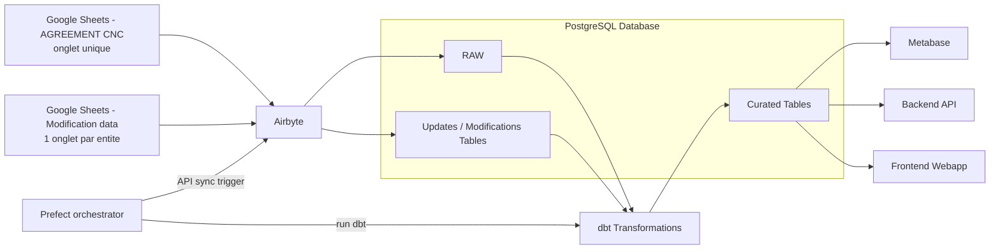
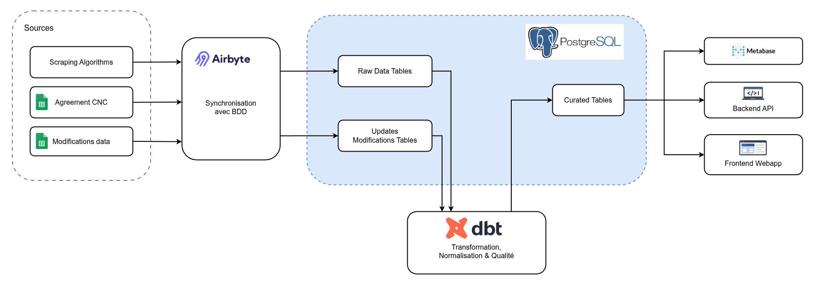

**Owner:** Joel Teixeira

**Last reviewed:** 2026-05-07

**Status:** draft

## Historique du document

| Date       | Author                    | Observations                                        |
|------------|---------------------------|-----------------------------------------------------|
| 2026-05-05 | Hugo Laurens, Joel Teixeira | Creation du document de processus propose         |
| 2026-05-07 | Joel Teixeira             | Normalisation des metadonnees et maintien du statut draft |

# Processus proposé de mise à jour des données (version validation métier)

## 1. Pourquoi ce changement

Aujourd'hui, les corrections de données (ex: nouveaux titres CNC, correction d'un genre ou d'une date de naissance) peuvent nécessiter des manipulations techniques et manuelles.

Objectif: permettre aux équipes non techniques de proposer des mises à jour de manière simple, traçable, et répétable chaque année, sans perdre l'historique des données brutes.

## 2. Principe général (simple)

Le nouveau processus repose sur 4 briques:

1. Google Sheets: point d'entrée des mises à jour métier (saisie par les équipes non-data).
2. Airbyte: ingestion automatique des Google Sheets vers la base de données (zone brute), avec un onglet unique pour `AGREEMENT CNC` et un onglet par entité pour `Modification data`.
3. Prefect: orchestration des syncs Airbyte via API, puis des exécutions `dbt`.
4. dbt: application des règles métier pour produire des données "corrigées" prêtes pour Metabase et le site web.

Important: les données brutes sont conservées. Les corrections sont appliquées en couche `fnl` (pas d'écrasement direct de la source brute).

## 3. Parcours utilisateur attendu

### User Story A (fichier CNC annuel)

1. Bob reçoit le fichier `agreement CNC 2026.csv`.
2. Bob copie les données dans le Google Sheet `AGREEMENT CNC`, dans l'onglet unique du fichier, en ajoutant les nouvelles lignes en bas du tableau.
3. Prefect déclenche le sync Airbyte via API.
4. Airbyte synchronise cet onglet unique vers la base (zone raw).
5. Prefect déclenche ensuite `dbt`.
6. dbt applique les règles de consolidation avec les données existantes (clé de jointure: `visa_number`).
7. Les nouveaux titres corrigés sont visibles dans Metabase et dans l'application web.

### User Story B (correction ponctuelle sur une entité)

1. Bob ouvre le Google Sheet `Modification data`.
2. Bob va dans l'onglet de l'entité concernée (ex: `CreditHolder`).
3. Bob ajoute une ligne:
   - `id`
   - `column_name`
   - `new_value`
   - `modification_date`
   - `requested_by`
   - `reason` (optionnel)
4. Prefect déclenche le sync Airbyte via API.
5. Airbyte ingère la ligne.
6. Prefect déclenche ensuite `dbt`.
7. dbt applique la correction sur la couche finale exposée aux outils de consultation.

## 4. Architecture technique cible

## 4.1 Lecture rapide du diagramme

1. Le point d'entrée métier est double: `AGREEMENT CNC` pour les nouvelles lignes CNC et `Modification data` pour les corrections ponctuelles.
2. `Prefect` orchestre le flux: il déclenche les syncs `Airbyte` via API puis les exécutions `dbt`.
3. Airbyte joue ici uniquement le rôle de passerelle d'ingestion vers PostgreSQL: il charge à la fois la zone brute (`RAW`) et les tables de modifications (`UPD`).
4. dbt lit ensuite ces deux couches pour produire une couche `CUR` qui concentre les règles de consolidation et de correction.
5. Les usages finaux partent tous de `CUR`: Metabase, l'API backend et la webapp consultent la même version consolidée des données.
6. Le diagramme montre donc un principe important: on ne corrige pas la source brute directement; on conserve l'historique et on applique les règles dans la couche `fnl`.

## 5. Bénéfices attendus

1. Processus répétable d'année en année.
2. Moins de dépendance aux interventions techniques manuelles.
3. Traçabilité de qui a demandé quoi et quand.
4. Conservation de l'historique (audit).
5. Réduction du risque d'erreurs de mise à jour directe.

## 6. Ce que ce processus ne fait pas (et c'est volontaire)

1. Il ne modifie pas automatiquement les fichiers source externes.
2. Il ne supprime pas les données brutes historiques.
3. Il n'autorise pas n'importe quelle colonne à être modifiée sans règles.

## 7. Points de validation à faire côté métier

1. Validation du nom unique de l'onglet CNC, des onglets de `Modification data`, et du format exact des colonnes.
2. Validation des rôles d'accès Google Sheets (qui peut éditer, qui peut seulement voir).
3. Validation des délais de prise en compte (ex: toutes les nuits, ou plusieurs fois par jour).
4. Validation des règles métier prioritaires (ex: si plusieurs corrections existent pour la même cellule).

## 7.1 Points de vigilance techniques et fonctionnels

1. Le diagramme fait converger plusieurs sources vers Airbyte; cela suppose des schémas de colonnes stables, sinon la synchronisation et les modèles dbt casseront au premier changement de feuille.
2. `UPD` est volontairement séparé de `RAW`; il faut garder cette frontière pour conserver la traçabilité des demandes et éviter des écrasements silencieux.
3. La couche `CUR` devient un point d'autorité unique pour trois consommateurs différents; toute règle de correction ambiguë ou non déterministe y aura un impact immédiat sur Metabase, l'API et le frontend.
4. Le déclenchement des syncs Airbyte via API par Prefect suppose des identifiants de connexion stables, des secrets gérés proprement et un suivi explicite du statut des jobs Airbyte.
5. Le diagramme reste volontairement simplifié: il ne montre pas encore les contrôles qualité détaillés, les retries ou les notifications.

## 8. Règle métier clé à communiquer

Pour les mises à jour CNC, la clé de correspondance est `visa_number`.
Le titre (`original_name`) est un attribut modifiable, pas une clé d'identification.
