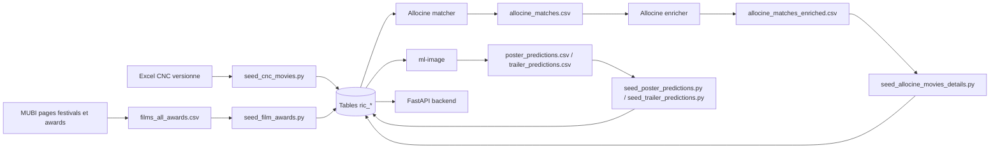
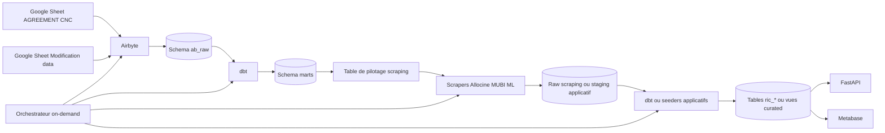

Owner: Joel Teixeira

Last reviewed: 2026-04-20

Status: draft

# Plan d'automatisation de la pipeline d'ingestion

## 1. Objectif du document

Ce document synthétise l'existant dans le repository, explique comment les briques scraping, base de données et backend interagissent aujourd'hui, puis propose un plan d'implémentation pour atteindre la cible suivante:

1. une personne du collectif 50/50 met à jour un Google Sheet une fois par an;
2. Airbyte synchronise ce Google Sheet, en particulier la liste CNC des films;
3. dbt fusionne l'historique brut et les nouvelles données pour produire une liste CNC consolidée;
4. cette liste consolidée alimente les algorithmes de scraping, qui enrichissent ensuite la base applicative;
5. l'ensemble est déclenché à la demande via un orchestrateur.

Ce document est une roadmap d'architecture: il décrit l'état actuel, les écarts, les arbitrages et les phases de migration. Les commandes de setup restent dans le runbook; les contrats de données restent dans la spécification.

## 2. Lecture du repository

### 2.1 Ce qui existe déjà

Le projet est déjà structuré autour de quatre couches bien séparées:

1. `database/`: schéma PostgreSQL, migrations Alembic, extracteurs, scrapers et scripts de seed.
2. `backend/`: API FastAPI, repositories SQLAlchemy, use cases métier.
3. `ingestion/`: workspace dédié à Airbyte et dbt.
4. `ml-image/`: pipeline de vision par ordinateur pour enrichir trailers et posters.

### 2.2 Interprétation globale

L'architecture actuelle n'est pas encore une pipeline automatisée continue. C'est une chaîne de traitements manuels, mais déjà découpée en étapes cohérentes:

1. des scripts extraient ou scrapent des données externes;
2. ces scripts produisent soit des objets Python temporaires, soit des CSV intermédiaires;
3. des scripts `database/seed/seed_*.py` injectent ces données dans PostgreSQL via SQLAlchemy et les repositories du backend;
4. le backend lit directement les tables applicatives `ric_*`.

Autrement dit, la logique métier existe déjà, mais elle est distribuée entre plusieurs scripts manuels sans orchestration, sans couche raw normalisée, et sans couche dbt réellement implémentée.

## 3. Etat actuel par brique

### 3.1 Base de données et modèle applicatif

La base PostgreSQL applicative est déjà structurée pour accueillir les données finales:

1. `database/models/film.py` définit `ric_films` avec les colonnes CNC, les identifiants externes (`allocine_id`, `mubi_id`) et les relations vers genres, crédits, trailers, posters et awards.
2. les autres modèles `database/models/` couvrent les tables de relation et d'enrichissement: `ric_film_credits`, `ric_festivals`, `ric_festival_awards`, `ric_award_nominations`, `ric_posters`, `ric_trailers`, `ric_poster_characters`, `ric_trailer_characters`.
3. les migrations existent déjà dans `database/alembic/versions/`.

Cette base est pensée comme une base métier enrichie, pas comme une zone raw d'ingestion historisée.

### 3.2 Backend

Le backend consomme directement les tables applicatives actuelles:

1. les repositories du dossier `backend/repositories/` encapsulent les accès SQLAlchemy;
2. les use cases comme `backend/use_cases/get_film_details.py` lisent directement `Film` et ses relations;
3. il n'y a pas encore de consommation de tables `mart_*` ou de vues dbt curated.

Conséquence: tant que la couche dbt n'est pas branchée au backend, la vérité métier reste dans les tables `ric_*` alimentées par les seeders.

### 3.3 Airbyte et dbt

La direction cible est déjà documentée et une première implémentation partielle dbt existe désormais pour le flux CNC:

1. `ingestion/dbt/dbt_project.yml` existe et configure un projet dbt minimal;
2. `ingestion/dbt/models/staging/stg_agreement_cnc.sql` normalise `ab_raw.agreement_cnc`;
3. `ingestion/dbt/models/staging/stg_raw_ric_films.sql` projette `raw.ric_films`;
4. `ingestion/dbt/models/intermediate/int_agreement_cnc_latest_by_visa.sql` déduplique la dernière version par `visa_number`;
5. `ingestion/dbt/models/marts/mart_cnc_films_for_scraping.sql` existe, mais reste un placeholder: il ne fusionne pas encore l'historique `raw.ric_films` et la dernière charge Airbyte;
6. `ingestion/airbyte/` reste vide côté versionnement de connecteurs ou manifests;
7. `docs/specifications/specification-airbyte-dbt-mises-a-jour-donnees.md` décrit la cible fonctionnelle;
8. `docs/runbooks/infra-setup-dbt-core-airbyte-remote-postgres.md` décrit l'installation d'Airbyte OSS et dbt Core.

Conclusion: la couche dbt n'est plus vide, mais le premier use case CNC n'est pas encore implémenté de bout en bout. Le mart final, l'orchestration et le packaging Airbyte restent à faire.

### 3.4 Orchestration

Il n'existe pas encore de véritable orchestrateur:

1. `docker-compose.yaml` ne déploie aujourd'hui que `db`, `backend` et `frontend`;
2. les scripts de seed sont lancés manuellement;
3. les scrapers Allocine et MUBI sont lancés manuellement;
4. la pipeline ML est lancée séparément.

Le projet possède donc des traitements, mais pas encore de moteur qui les enchaîne proprement à la demande.

## 4. Ce qui est déjà fait côté ingestion et scraping

### 4.1 CNC

Source actuelle:

1. fichier Excel versionné dans `database/data/cnc/`;
2. extraction et nettoyage via `database/data/cnc/extract_cnc_data_from_excel.py`.

Comportement actuel:

1. le script charge toutes les feuilles annuelles du fichier Excel;
2. il renomme, caste et nettoie les colonnes;
3. il normalise les drapeaux booléens, les budgets, les diffuseurs et les allocations par pays.

Injection en base:

1. `database/seed/seed_cnc_movies.py` lit l'Excel nettoyé;
2. il crée les films dans `ric_films`;
3. il crée les allocations budgétaires par pays dans `ric_film_country_budget_allocations`;
4. il crée aussi certains crédits liés aux diffuseurs dans `ric_film_credits`.

Ce que cela veut dire: la CNC est aujourd'hui la source primaire de la table `ric_films`.

### 4.2 Allocine

Source actuelle:

1. le mart dbt `marts.mart_cnc_films_for_scraping` est le point de départ prévu, mais son implémentation actuelle est partielle;
2. la base applicative reste la cible des enrichissements via les seeders.

Comportement actuel:

1. `database/data/allocine/allocine_film_matcher.py` lit `marts.mart_cnc_films_for_scraping` et ne traite que les lignes marquées `should_scrape_allocine`, mais ce flag est encore temporaire côté dbt;
2. `database/data/allocine/allocine_film_enricher.py` recharge le CSV de matching puis scrape les pages film et casting;
3. `database/data/allocine/allocine_runner.py` sert de CLI pour exécuter matcher et enricher;
4. le scraping dépend de `database/data/scraping_browser.py` et d'un navigateur distant Playwright/Chromium.

Sortie intermédiaire:

1. `database/data/allocine/allocine_matches.csv`;
2. `database/data/allocine/allocine_matches_enriched.csv`.

Injection en base:

1. `database/seed/seed_allocine_movies_details.py` lit le CSV enrichi;
2. il met à jour `ric_films` avec `allocine_id`, date de sortie, durée et catégories de genre;
3. il crée ou met à jour `ric_trailers` et `ric_posters`;
4. il crée les genres et les liens film-genre;
5. il crée les crédits film associés au casting, à la direction, à la production, à la distribution et aux sociétés.

Ce que cela veut dire: le point d'entrée cible Allocine n'est plus la table historique brute, mais la liste consolidée publiée par dbt. Aujourd'hui, cette liste est encore partielle car `mart_cnc_films_for_scraping` reste un placeholder. Le handoff CSV entre matching et enrichissement reste encore manuel.

### 4.3 MUBI

Source actuelle:

1. pages festival MUBI;
2. pages awards des films MUBI.

Comportement actuel:

1. `database/data/mubi/mubi_all_festival_films_to_csv.py` scrape des listes paginées de films par festival et par année;
2. `database/data/mubi/mubi_all_film_awards_to_csv.py` recharge le CSV des films puis scrape les pages awards;
3. les scripts s'appuient aussi sur `database/data/scraping_browser.py`.

Sortie intermédiaire:

1. CSV de films de festival;
2. `database/data/mubi/films_all_awards.csv`.

Injection en base:

1. `database/seed/seed_film_awards.py` lit le CSV des récompenses;
2. il fait du matching approximatif avec les films existants;
3. si un film n'existe pas, il peut créer un film minimal;
4. il crée ou relie pays, festivals, awards, nominations et directeurs.

Ce que cela veut dire: la brique MUBI enrichit surtout le périmètre festivals/récompenses, avec une qualité de matching encore dépendante du titre et du réalisateur.

### 4.4 Machine learning trailers et posters

Source actuelle:

1. le dossier `ml-image/` contient la pipeline de vision par ordinateur;
2. cette pipeline produit des CSV de prédictions par `visa_number`.

Comportement actuel:

1. les modèles détectent visages, âge, genre et ethnicité sur les frames de trailer et sur les posters;
2. les sorties sont écrites dans `database/data/machine_learning_predictions/`.

Injection en base:

1. `database/seed/seed_poster_predictions.py` relit `poster_predictions.csv`;
2. `database/seed/seed_trailer_predictions.py` relit `trailer_predictions.csv`;
3. les deux scripts suppriment d'abord les prédictions existantes sur le périmètre visé, puis recréent `ric_poster_characters` et `ric_trailer_characters`.

Ce que cela veut dire: la brique ML dépend implicitement du fait qu'Allocine ait déjà alimenté posters et trailers dans la base.

## 5. Comment ces briques interagissent aujourd'hui

## 5.1 Graphe logique actuel

## 5.2 Lecture pragmatique de l'existant

L'interaction réelle entre modules est la suivante:

1. CNC crée l'inventaire initial des films.
2. Allocine enrichit cet inventaire avec les métadonnées film, les médias et les crédits.
3. MUBI enrichit les festivals et récompenses.
4. ML enrichit trailers et posters déjà connus.
5. le backend consomme directement le résultat final en base.

Le point fort est que la logique métier d'enrichissement existe déjà.
Le point faible est que la chaîne de dépendances est implicite, manuelle, et peu observable.

## 6. Ecart entre l'existant et la cible

Par rapport à la mission d'automatisation, il manque les éléments suivants:

1. un point d'entrée métier stable dans Google Sheets à la place du fichier Excel CNC versionné dans le repo;
2. une ingestion Airbyte réellement configurée vers une zone raw historisée, par exemple `ab_raw`;
3. des modèles dbt qui consolident le flux annuel CNC et produisent une liste de films autoritative pour le scraping;
4. une adaptation des scrapers pour qu'ils lisent cette liste consolidée, et non plus directement l'Excel initial ou l'état courant ad hoc de la base;
5. un orchestrateur qui séquence Airbyte, dbt, scrapers, seeders et contrôles qualité;
6. une stratégie de reprise sur erreur et d'observabilité.

## 7. Architecture cible recommandée

## 7.1 Principe directeur

La bonne séparation des responsabilités est la suivante:

1. Airbyte extrait et charge les sources dans la zone raw;
2. dbt consolide et publie des tables de travail et des marts;
3. les scrapers enrichissent à partir d'une table de pilotage produite par dbt;
4. l'orchestrateur pilote l'ordre d'exécution, les relances, les journaux et le déclenchement à la demande.

Important: Airbyte ne doit pas devenir l'orchestrateur principal. Même si les scrapers sont encapsulés dans des connecteurs Airbyte custom, l'enchaînement de bout en bout doit rester piloté par un orchestrateur externe.

## 7.2 Architecture cible

## 8. Choix d'implémentation recommandés

### 8.1 Point d'autorité pour la liste des films à scraper

La table `mart_cnc_films_for_scraping` est le bon point d'autorité cible côté scraping, mais elle n'est pas encore prête. Elle doit contenir les éléments structurants suivants:

1. `visa_number`;
2. `original_name` consolidé;
3. `cnc_agrement_year`;
4. les colonnes utiles au matching Allocine;
5. des drapeaux opérationnels `is_new_film`, `has_cnc_payload_change` et `should_scrape_allocine`.

Cette table doit devenir l'unique point d'entrée des scrapers une fois la logique de fusion implémentée.

Concrètement, la logique cible est:

1. `ab_raw.agreement_cnc` est normalisée en staging;
2. la dernière ligne Airbyte est conservée pour chaque `visa_number`;
3. cette version est fusionnée par `visa_number` avec `raw.ric_films`;
4. les champs CNC prennent la priorité sur l'historique quand une nouvelle valeur existe;
5. la table finale expose à la fois les valeurs fusionnées et les valeurs d'origine pour audit.

Etat actuel du code: le modèle `mart_cnc_films_for_scraping.sql` lit seulement `stg_raw_ric_films`, marque temporairement `should_scrape_allocine` pour un `film_id` fixe, et contient un TODO de fusion. Il ne doit pas encore être utilisé comme mart CNC consolidé.

### 8.2 Frontière entre dbt et base applicative

Deux options existent:

1. option minimale: dbt prépare la liste de travail, puis les seeders continuent d'alimenter les tables `ric_*` existantes;
2. option cible: dbt produit aussi des marts curated consommées par le backend.

Recommandation pragmatique: commencer par l'option minimale pour automatiser l'ingestion sans refondre tout le backend dans la même phase.

### 8.3 Intégration des scrapers dans Airbyte

Deux variantes sont possibles:

1. variante recommandée: les scrapers restent des jobs Python orchestrés, distincts d'Airbyte;
2. variante conforme au besoin formulé: encapsuler Allocine, MUBI et éventuellement la préparation ML dans des connecteurs Airbyte custom Python CDK.

Si l'objectif politique est bien d'"inclure les scrapers dans Airbyte", alors il faut les penser comme des sources pilotées par l'orchestrateur, pas comme un substitut au scheduler global.

### 8.4 Orchestrateur

Le repo n'a actuellement aucune brique d'orchestration. Pour un déclenchement à la demande, avec dépendances multi-étapes et exécution Docker/Python, il faut ajouter une brique dédiée.

Recommandation pragmatique:

1. utiliser un orchestrateur Python simple à intégrer dans le repo;
2. déclencher Airbyte via API;
3. déclencher dbt par CLI ou wrapper Python;
4. déclencher les scrapers et seeders comme tâches versionnées;
5. exposer un run manuel depuis UI ou CLI.

Le choix précis de l'outil peut être arbitré entre Airflow, Dagster et Prefect, mais il faut prendre cette décision avant de coder la phase d'automatisation.

## 9. Plan d'implémentation / modifications nécessaires

## Phase 0 - Cadrage et contrats

Objectif: verrouiller les contrats de données avant toute automatisation.

Etapes:

1. figer le schéma du Google Sheet `AGREEMENT CNC` et imposer `visa_number` comme clé métier;
2. décider si les corrections métier passent aussi par `Modification data` dès la V1;
3. définir la politique de rescraping: nouveaux films uniquement, ou rescraping ciblé si certaines colonnes changent;
4. décider du périmètre V1 exact: CNC + Allocine d'abord, puis MUBI et ML.

Modifications attendues dans le repo:

1. mise à jour éventuelle de `docs/specifications/specification-airbyte-dbt-mises-a-jour-donnees.md`;
2. ajout d'un dictionnaire de données versionné pour les colonnes CNC.

## Phase 1 - Ingestion Airbyte du Google Sheet CNC

Objectif: remplacer l'Excel versionné par une source raw historisée.

Etapes:

1. créer la source Airbyte Google Sheets `src_gsheet_agreement_cnc`;
2. créer la destination Postgres `dst_pg` sur le schéma `ab_raw`;
3. créer la connexion `cnx_agreement_cnc_to_pg`;
4. valider qu'un ajout de lignes annuel est bien répliqué sans casser l'historique;
5. versionner dans `ingestion/airbyte/` la configuration exportée ou les manifestes nécessaires.

Modifications attendues dans le repo:

1. peu ou pas de changement dans `database/` à ce stade;
2. ajout d'assets Airbyte versionnés dans `ingestion/airbyte/`;
3. documentation d'exploitation pour la source Google Sheets.

## Phase 2 - Construction dbt de la liste CNC consolidée

Objectif: produire une liste fiable pour piloter les enrichissements.

Etapes:

1. créer les sources dbt sur `ab_raw.agreement_cnc` et `raw.ric_films`;
2. créer `stg_agreement_cnc`;
3. créer `stg_raw_ric_films`;
4. créer `int_agreement_cnc_latest_by_visa`;
5. créer `mart_cnc_films_for_scraping`;
6. ajouter les tests dbt de non-null et unicité sur `visa_number`;
7. documenter le lineage.

Etat actuel:

1. les modèles staging et intermédiaire existent dans `ingestion/dbt/models/`;
2. le mart final est seulement un placeholder et ne réalise pas la fusion CNC Airbyte + historique;
3. le matcher Allocine lit maintenant ce mart, donc son périmètre dépend d'une logique temporaire;
4. la prochaine étape utile est d'implémenter réellement le mart avant de supprimer les handoffs CSV manuels ou d'introduire une queue de scraping.

Modifications attendues dans le repo:

1. création de modèles dans `ingestion/dbt/models/`;
2. ajout de `sources.yml`, `schema.yml` et tests associés;
3. éventuelle création d'un seed dbt pour les mappings métier stables.

## Phase 3 - Refactor des scrapers pour consommer la liste consolidée

Objectif: découpler les scrapers du fichier CNC historique et de l'état implicite actuel.

Etapes:

1. introduire une interface de lecture unique pour la liste des films à scraper;
2. faire lire Allocine à partir de `mart_cnc_films_for_scraping` au lieu de dépendre du chargement Excel d'origine;
3. définir pour MUBI si la source reste événementielle indépendante ou si elle doit aussi être pilotée depuis une table de travail;
4. introduire un identifiant de run et des statuts de traitement.

Modifications attendues dans le repo:

1. modification de `database/data/allocine/allocine_film_matcher.py` pour lire depuis une source consolidée;
2. probable ajout d'un module partagé de lecture de dataset de scraping;
3. ajout d'une table ou vue de pilotage de run.

## Phase 4 - Industrialisation des sorties de scraping

Objectif: rendre les enrichissements rejouables et observables.

Etapes:

1. standardiser les sorties scraping avec `run_id`, `source_url`, `extracted_at`, `record_hash` quand utile;
2. décider si les scrapers écrivent encore des CSV temporaires ou s'ils poussent directement vers une table raw/staging;
3. supprimer progressivement les handoffs CSV manuels versionnés dans le repo;
4. séparer clairement le raw scraping de l'injection dans les tables métier.

Modifications attendues dans le repo:

1. refactor de `database/data/allocine/` et `database/data/mubi/`;
2. éventuelle création de tables raw de scraping;
3. ajustement des scripts `database/seed/seed_allocine_movies_details.py` et `database/seed/seed_film_awards.py`.

## Phase 5 - Intégration dans Airbyte ou packaging en jobs réutilisables

Objectif: rendre les scrapers pilotables par l'orchestrateur dans un format stable.

Etapes:

1. créer un wrapper standard par scraper;
2. si le besoin "dans Airbyte" est maintenu, encapsuler Allocine et MUBI en connecteurs custom Airbyte Python CDK;
3. sinon, publier ces wrappers comme tâches d'orchestration dédiées;
4. conserver le même contrat de sortie, quel que soit le mode d'exécution.

Modifications attendues dans le repo:

1. ajout de code dans `ingestion/airbyte/` si connecteurs custom;
2. sinon ajout d'un dossier dédié d'orchestration, par exemple `orchestration/`.

## Phase 6 - Orchestration on-demand

Objectif: exécuter la chaîne complète à la demande, de manière traçable.

Séquence cible:

1. déclenchement manuel d'un run;
2. sync Airbyte du Google Sheet CNC;
3. `dbt build` pour produire la liste consolidée;
4. exécution du scraper Allocine sur les films à traiter;
5. injection des données enrichies;
6. exécution éventuelle du scraping MUBI;
7. exécution éventuelle de la pipeline ML si trailer/poster disponibles;
8. contrôles qualité finaux;
9. publication d'un statut de run.

Modifications attendues dans le repo:

1. ajout d'une brique d'orchestration versionnée;
2. ajout de variables d'environnement et secrets associés;
3. ajout de logs structurés et d'un identifiant de run partagé par toutes les étapes.

## Phase 7 - Evolution du backend et de la BI

Objectif: consommer progressivement des données plus propres et plus traçables.

Etapes:

1. à court terme, continuer à alimenter les tables `ric_*` pour ne pas casser le backend;
2. à moyen terme, introduire des vues ou tables curated lues par le backend à la place des tables sources directes;
3. adapter Metabase et les repositories backend pour lire la couche publiée la plus stable.

## 10. Ordre de priorité recommandé

Pour réduire le risque, l'ordre recommandé est:

1. CNC Google Sheet -> Airbyte -> dbt;
2. table consolidée `mart_cnc_films_for_scraping` (cible, non encore implémentée);
3. refactor Allocine pour lire cette table;
4. orchestration on-demand de la chaîne CNC + Allocine;
5. intégration MUBI;
6. intégration ML;
7. migration progressive du backend vers des tables/vues curated.

## 11. Risques et points d'attention

1. forcer tous les scrapers dans Airbyte trop tôt risque de complexifier la V1 sans bénéfice immédiat;
2. les scrapers Allocine et MUBI dépendent de sélecteurs HTML fragiles et d'un navigateur distant;
3. le matching MUBI est aujourd'hui moins robuste que le flux CNC -> Allocine;
4. la pipeline ML ajoute des dépendances lourdes et doit rester une étape conditionnelle dans la V1;
5. le backend lit encore directement les tables métier existantes, donc une refonte simultanée ingestion + exposition serait trop risquée.

## 12. Proposition de lot V1 réaliste

Une V1 réaliste et utile serait:

1. Google Sheet `AGREEMENT CNC` comme source unique métier;
2. Airbyte vers `ab_raw`;
3. dbt pour produire `mart_cnc_films_for_scraping` (cible, non encore implémentée);
4. orchestrateur on-demand;
5. scraper Allocine automatisé sur cette liste;
6. injection automatique dans les tables `ric_*` actuelles.

Dans cette V1, MUBI, ML et la bascule complète du backend sur des marts peuvent rester en phase 2.

## 13. Résumé exécutif

Le repository contient déjà l'essentiel de la logique métier d'enrichissement, mais pas encore la chaîne d'automatisation.

Le chemin le plus sûr pour atteindre l'objectif est:

1. industrialiser d'abord la source CNC via Google Sheets + Airbyte;
2. produire avec dbt une liste consolidée qui devient la source de vérité du scraping;
3. brancher Allocine sur cette liste;
4. ajouter un orchestrateur qui pilote Airbyte, dbt, scraping et injection;
5. intégrer ensuite MUBI et ML sans casser la base applicative existante.
