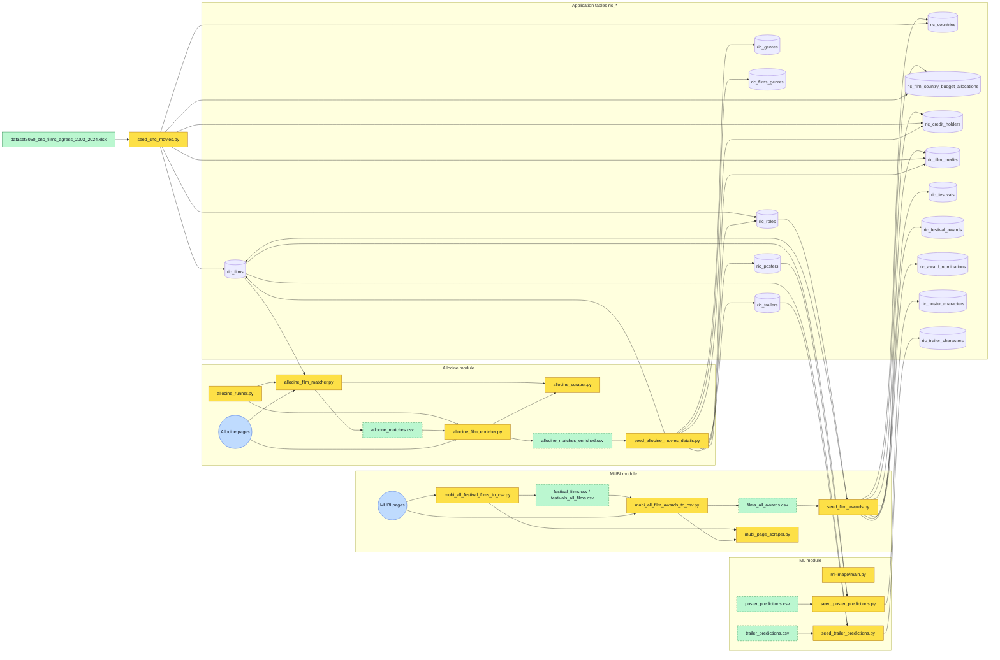
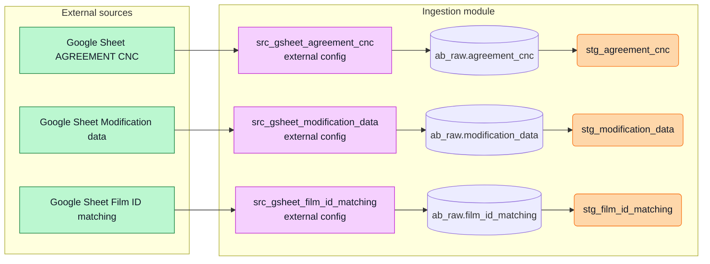

Owner: Joel Teixeira

Last reviewed: 2026-05-05

Status: Etat actuel du projet + draft d'architecture pour airbyte et dbt.

# Schéma ingestion, seeds, Airbyte et dbt

Ce schéma montre les relations entre scripts de seed, tables PostgreSQL, connecteurs Airbyte et modèles dbt.

Important:

1. `ingestion/airbyte/` ne contient aujourd'hui qu'un `.gitkeep`; les connecteurs Airbyte sont documentés comme configuration externe, pas encore versionnés dans le repo.

## Diagramme de flux global actuel

## Diagramme de flux focalisé sur Airbyte et dbt

## Lecture rapide

1. Le diagramme global montre une chaîne de dépendances centrée sur `ric_films`: le seed CNC crée l'inventaire de base, puis les briques Allocine, MUBI et ML ajoutent chacune leur enrichissement sur des tables `ric_*` déjà peuplées.
2. Le flux Allocine est en deux temps: matching vers `allocine_matches.csv`, enrichissement vers `allocine_matches_enriched.csv`, puis injection finale dans `ric_films`, `ric_posters`, `ric_trailers`, `ric_genres`, `ric_films_genres`, `ric_credit_holders` et `ric_film_credits`.
3. Le flux MUBI part des pages web, passe par des CSV intermédiaires, puis alimente surtout les dimensions festivals, prix, nominations et une partie des crédits, avec possibilité de créer un film minimal si aucun film applicatif ne matche.
4. Le flux ML ne remonte pas directement depuis `ml-image/main.py` vers la base: dans l'état actuel documenté, les seeds lisent surtout les CSV de prédictions déjà disponibles et recréent `ric_poster_characters` et `ric_trailer_characters`.
5. Le diagramme Airbyte/dbt isole une autre couche: Google Sheets alimente `ab_raw`, puis dbt normalise chaque source via `stg_agreement_cnc`, `stg_modification_data` et `stg_film_id_matching` avant toute consolidation métier.
6. Ce second diagramme décrit donc une cible d'ingestion et de préparation, pas encore le chaînage complet vers les seeds applicatifs visibles dans le diagramme global.
7. Le point de jonction cible entre les deux mondes reste la consolidation CNC par `visa_number`: une fois publiée par dbt, elle doit redevenir l'entrée fiable du seed CNC puis des scrapers.
8. Les fichiers statiques actuellement versionnés sont:
   - `database/data/cnc/dataset5050_cnc_films_agrees_2003_2024.xlsx`
   - `database/data/mubi/films_all_awards.csv`
   - `database/data/machine_learning_predictions/poster_predictions.csv`
   - `database/data/machine_learning_predictions/trailer_predictions.csv`

## Points de vigilance

1. Le diagramme Airbyte/dbt ne montre aujourd'hui que les modèles de staging; la fusion réelle entre historique CNC, nouvelles charges Airbyte et éventuelles corrections métier n'apparaît pas encore dans le schéma ni dans le code versionné.
2. La dépendance globale à `ric_films` impose un ordre strict: seed CNC d'abord, enrichissement Allocine ensuite, seed MUBI et seeds ML seulement quand les médias et films existent déjà.
3. Le handoff par CSV reste un point fragile pour Allocine, MUBI et ML: ces fichiers intermédiaires peuvent devenir obsolètes, être régénérés partiellement, ou diverger de la base si aucune orchestration ne fige l'ordre d'exécution.
4. `ingestion/airbyte/` ne versionne toujours pas les connecteurs ni les connexions; le diagramme de cible repose donc sur une configuration externe qui peut dériver du repo.
5. Le Google Sheet `Film ID matching` apparaît dans le schéma Airbyte/dbt, mais son usage aval n'est pas encore raccordé explicitement au matching applicatif dans le diagramme global.
6. `ml-image/main.py` n'est pas, à lui seul, la garantie de production des CSV de prédictions affichés dans le schéma; il faut documenter ou automatiser clairement la génération de ces artefacts pour éviter une confusion entre inputs existants et sorties réelles.
7. Les rôles et crédits sont alimentés par plusieurs flux (`seed_cnc_movies.py`, `seed_allocine_movies_details.py`, `seed_film_awards.py`); sans règles de précédence explicites, le risque est d'écraser ou dupliquer des informations métier.
