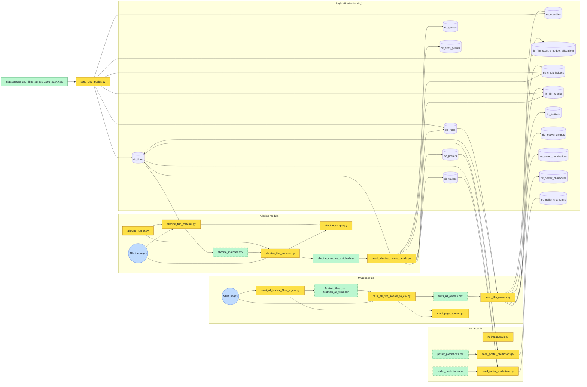
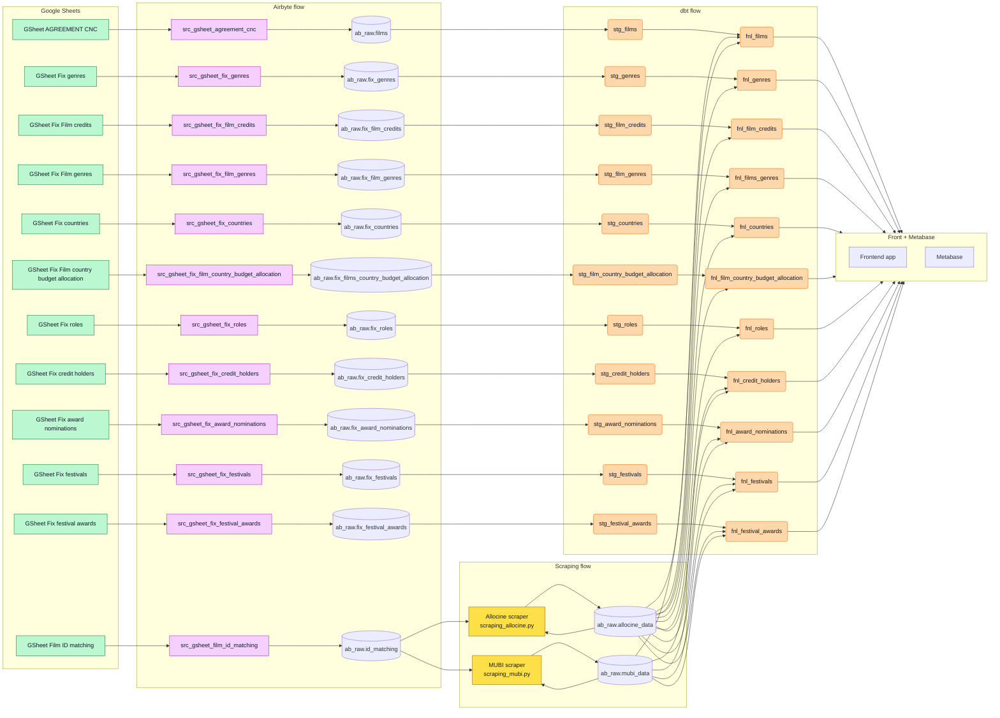

Owner: Joel Teixeira

Last reviewed: 2026-05-05

Status: Etat actuel du projet + draft d'architecture pour airbyte et dbt.

## Diagramme de flux global actuel

## Architecture cible

## Lecture rapide de l'architecture cible

1. Les Google Sheets restent les points d'entrée des corrections métier, puis Airbyte les charge dans `ab_raw`.
2. dbt normalise ces tables brutes en `stg_*`, puis publie des tables finales `fnl_*` consommées par le frontend et Metabase.
3. Les scrapers sont prévus comme des exécutions Airbyte, tandis que Prefect orchestre l'ordre global des runs, les dépendances, les relances et le déclenchement bout en bout.
4. Les scrapers n'utilisent pas uniquement `id_matching`: ils lisent aussi la table dans laquelle ils écrivent déjà pour savoir ce qui a déjà été traité.
5. Pour Allociné, le scraper charge `ab_raw.allocine_data` pour récupérer les IDs déjà scrapés.
6. Il charge en parallèle `ab_raw.id_matching` pour obtenir la liste complète des IDs à traiter.
7. Il compare les deux listes et isole les IDs présents dans `id_matching` mais absents de `allocine_data`.
8. Le scraping cible ne porte donc que sur les IDs manquants, puis les nouvelles données scrapées sont ajoutées à la table existante.
9. Le même principe s'applique au flux MUBI: la table de sortie existante sert de mémoire d'exécution, et `id_matching` sert de liste de référence.

## Points de vigilance sur le scraping cible

1. La logique de comparaison suppose que les IDs portés par `id_matching`, `allocine_data` et `mubi_data` soient strictement homogènes en format et en clé métier.
2. Si la table de sortie contient des lignes partielles, en erreur ou obsolètes, le scraper peut considérer à tort un ID comme déjà traité.
3. Ajouter uniquement les IDs manquants évite de retraiter tout l'historique, mais impose une stratégie claire de rescraping quand une donnée source change ou quand un scraping précédent était incomplet.
4. La table de sortie devient à la fois un stockage de résultats et un registre d'avancement; il faut donc tracer les erreurs, dates de scraping et éventuels statuts de reprise.
5. Le découpage Airbyte exécution / Prefect orchestration doit rester net: Airbyte lance les connecteurs de scraping, mais Prefect garde la responsabilité du chaînage global, des retries inter-étapes et de la supervision.
6. Si plusieurs runs s'exécutent en parallèle, le calcul des IDs manquants peut produire des doublons d'écriture sans verrouillage ou contrainte d'unicité adaptée.
